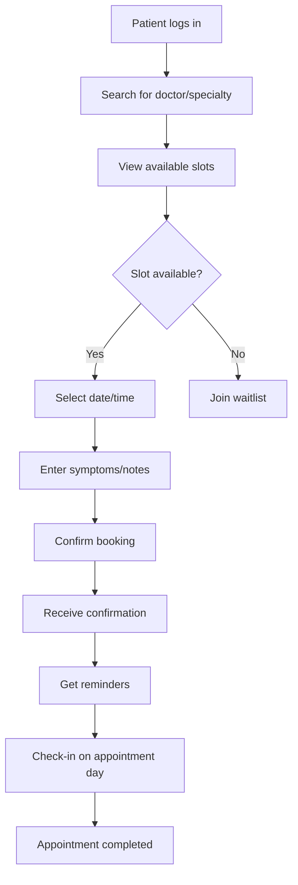
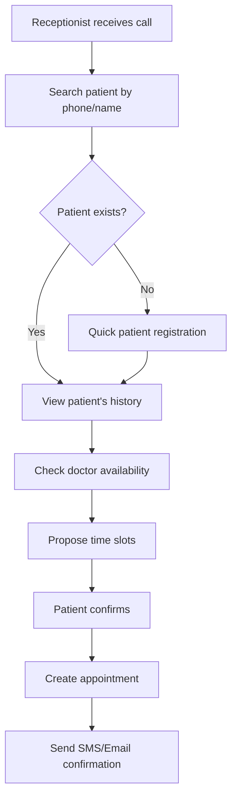
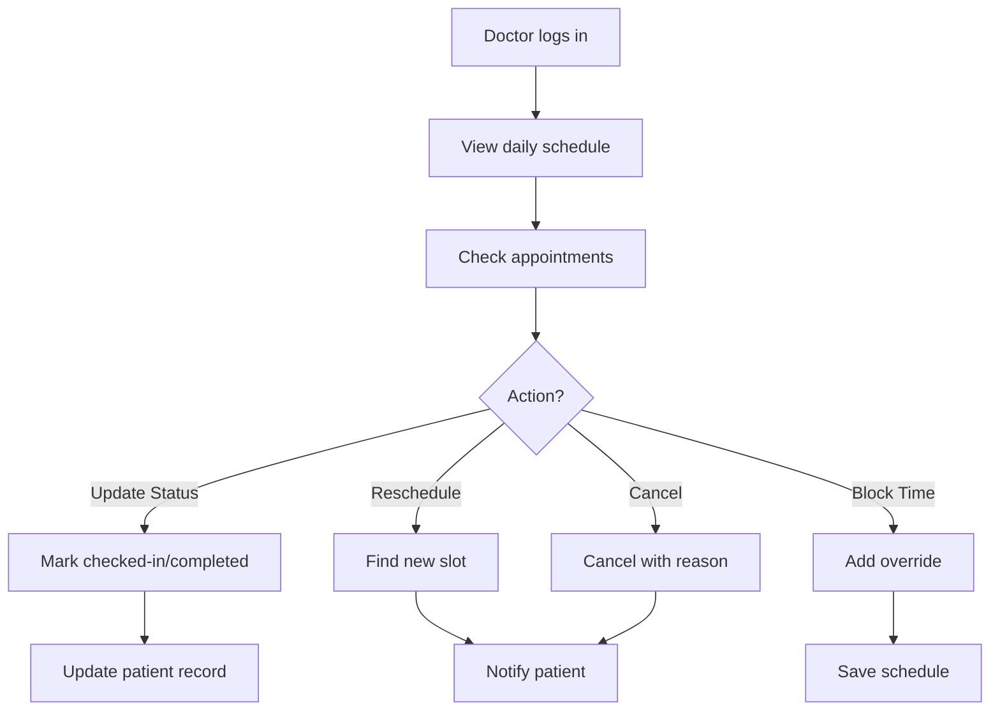

# Patient Appointment Scheduling System - Design & Architecture

## 📋 Table of Contents
- [Overview](#overview)
- [Current State Analysis](#current-state-analysis)
- [Appointment Types & Categories](#appointment-types--categories)
- [Core Requirements](#core-requirements)
- [System Architecture](#system-architecture)
- [Database Schema Design](#database-schema-design)
- [API Design](#api-design)
- [Frontend Component Design](#frontend-component-design)
- [Business Logic & Rules](#business-logic--rules)
- [Workflow & User Journeys](#workflow--user-journeys)
- [Advanced Features](#advanced-features)
- [Technical Considerations](#technical-considerations)
- [Implementation Roadmap](#implementation-roadmap)

---

## 🎯 Overview

The **MediSteps Appointment Scheduling System** is designed to handle multi-type appointments for a healthcare clinic with multiple doctors, staff roles, and patient interactions. The system should provide:

- **Real-time availability checking**
- **Multi-type appointment support**
- **Role-based access control** (Admin, Doctor, Receptionist, Nurse)
- **Conflict prevention**
- **Automated reminders & notifications**
- **Waitlist management**
- **Rescheduling & cancellation handling**

---

## 🔍 Current State Analysis

### Existing Components
1. **`appointment-scheduler.tsx`** - Calendar and list view for appointments
2. **`appointment-form.tsx`** - Dialog form for creating/editing appointments

### Current Mock Data Structure
```typescript
interface Appointment {
  id: string;
  patientName: string;
  doctorId: string;
  date: Date;
  time: string;
  duration: number; // in minutes
  status: 'scheduled' | 'checked-in' | 'in-progress' | 'completed' | 'cancelled';
  type: 'Consultation' | 'Follow-up' | 'Treatment' | 'Checkup' | 'Emergency' | 'Surgery';
}
```

### Gaps Identified
- ❌ No backend API integration
- ❌ No real-time availability checking
- ❌ No conflict detection
- ❌ No recurring appointment support
- ❌ No waitlist management
- ❌ No notification system
- ❌ No appointment history tracking
- ❌ Limited appointment metadata

---

## 🏥 Appointment Types & Categories

### 1. **Primary Appointment Types**

| Type | Duration | Priority | Description |
|------|----------|----------|-------------|
| **Consultation** | 30-45 min | Normal | First-time patient visit or new condition |
| **Follow-up** | 15-30 min | Normal | Scheduled review after treatment |
| **Treatment** | 30-120 min | Normal | Procedure or therapeutic session |
| **Checkup** | 15-20 min | Normal | Routine health examination |
| **Emergency** | 15-60 min | High | Urgent medical attention required |
| **Surgery** | 120-240 min | High | Scheduled surgical procedure |
| **Diagnostic** | 30-60 min | Normal | Lab tests, imaging, etc. |
| **Vaccination** | 10-15 min | Low | Immunization appointments |
| **Counseling** | 45-60 min | Normal | Mental health or lifestyle counseling |

### 2. **Appointment Subtypes**

```typescript
interface AppointmentCategory {
  type: AppointmentType;
  subtype?: string;
  specialty?: string; // Cardiology, Neurology, Pediatrics, etc.
  requiresEquipment?: string[]; // X-ray, ECG, etc.
  requiresAssistance?: boolean; // Need nurse/assistant
}
```

**Examples:**
- **Consultation → New Patient Consultation (Cardiology)**
- **Treatment → Physiotherapy Session**
- **Diagnostic → ECG Test**
- **Follow-up → Post-Surgery Review**

### 3. **Virtual vs In-Person**
```typescript
enum AppointmentMode {
  IN_PERSON = 'IN_PERSON',
  VIRTUAL = 'VIRTUAL',
  HYBRID = 'HYBRID' // Option for either
}
```

---

## 📦 Core Requirements

### Functional Requirements

#### 1. **Appointment Booking**
- ✅ Patient can book appointment online or via receptionist
- ✅ Select doctor based on specialty
- ✅ View real-time availability
- ✅ Choose appointment type and duration
- ✅ Add notes/symptoms
- ✅ Book for self or dependent

#### 2. **Availability Management**
- ✅ Doctor can set working hours
- ✅ Define time slots (15/30/45/60 minutes)
- ✅ Block unavailable times (leave, meetings, emergencies)
- ✅ Recurring schedules (weekly patterns)
- ✅ Override specific dates

#### 3. **Appointment Lifecycle**
```
[Scheduled] → [Confirmed] → [Checked-In] → [In-Progress] → [Completed]
                    ↓
              [Rescheduled]
                    ↓
               [Cancelled]
                    ↓
               [No-Show]
```

#### 4. **Conflict Prevention**
- ❌ No double-booking for doctors
- ❌ Respect buffer times between appointments
- ❌ Check equipment/room availability
- ❌ Validate patient's existing appointments

#### 5. **Notifications & Reminders**
- 📧 Email confirmation
- 📱 SMS reminder (24h before)
- 📲 WhatsApp reminder (2h before)
- 🔔 In-app notification
- 🚨 Emergency alerts

---

## 🏗️ System Architecture

### High-Level Components

```
┌─────────────────────────────────────────────────────────┐
│                    Frontend Layer                        │
│  ┌──────────────┐  ┌──────────────┐  ┌──────────────┐  │
│  │ Scheduler UI │  │ Calendar View│  │ Patient Portal│  │
│  └──────────────┘  └──────────────┘  └──────────────┘  │
└─────────────────────────────────────────────────────────┘
                           │
                           ▼
┌─────────────────────────────────────────────────────────┐
│                    Backend API Layer                     │
│  ┌──────────────┐  ┌──────────────┐  ┌──────────────┐  │
│  │ Appointment  │  │ Availability │  │ Notification │  │
│  │   Service    │  │   Service    │  │   Service    │  │
│  └──────────────┘  └──────────────┘  └──────────────┘  │
└─────────────────────────────────────────────────────────┘
                           │
                           ▼
┌─────────────────────────────────────────────────────────┐
│                    Database Layer                        │
│  ┌──────────────┐  ┌──────────────┐  ┌──────────────┐  │
│  │ Appointments │  │  Schedules   │  │  Waitlist    │  │
│  └──────────────┘  └──────────────┘  └──────────────┘  │
└─────────────────────────────────────────────────────────┘
```

### Technology Stack
- **Frontend:** React + TypeScript + Vite
- **UI Library:** shadcn-ui + Radix UI
- **State Management:** React Query (TanStack Query)
- **Calendar:** `date-fns` + custom components
- **Backend:** Spring Boot (Java)
- **Database:** PostgreSQL / MySQL
- **Notifications:** Twilio (SMS), SendGrid (Email), WhatsApp Business API

---

## 🗄️ Database Schema Design

### 1. **Appointments Table**

```sql
CREATE TABLE appointments (
    id BIGSERIAL PRIMARY KEY,
    appointment_id VARCHAR(50) UNIQUE NOT NULL, -- e.g., APT2025001
    
    -- Patient & Doctor
    patient_id BIGINT NOT NULL REFERENCES patients(id),
    doctor_id BIGINT NOT NULL REFERENCES staff(id),
    
    -- Appointment Details
    appointment_type VARCHAR(50) NOT NULL, -- CONSULTATION, FOLLOWUP, etc.
    appointment_subtype VARCHAR(100),
    specialty VARCHAR(100),
    appointment_mode VARCHAR(20) DEFAULT 'IN_PERSON', -- IN_PERSON, VIRTUAL
    
    -- Scheduling
    appointment_date DATE NOT NULL,
    start_time TIME NOT NULL,
    end_time TIME NOT NULL,
    duration_minutes INT NOT NULL DEFAULT 30,
    
    -- Status & Tracking
    status VARCHAR(30) NOT NULL DEFAULT 'SCHEDULED',
    -- SCHEDULED, CONFIRMED, CHECKED_IN, IN_PROGRESS, COMPLETED, CANCELLED, NO_SHOW, RESCHEDULED
    
    priority VARCHAR(20) DEFAULT 'NORMAL', -- LOW, NORMAL, HIGH, EMERGENCY
    
    -- Patient Information
    chief_complaint TEXT, -- Patient's reason for visit
    symptoms TEXT,
    notes TEXT, -- Staff notes
    
    -- Confirmation & Communication
    confirmation_sent_at TIMESTAMP,
    reminder_sent_at TIMESTAMP,
    patient_confirmed_at TIMESTAMP,
    
    -- Check-in Details
    checked_in_at TIMESTAMP,
    checked_in_by BIGINT REFERENCES staff(id),
    
    -- Completion Details
    started_at TIMESTAMP,
    completed_at TIMESTAMP,
    actual_duration_minutes INT,
    
    -- Cancellation/Rescheduling
    cancelled_at TIMESTAMP,
    cancelled_by BIGINT REFERENCES staff(id),
    cancellation_reason TEXT,
    
    rescheduled_from_id BIGINT REFERENCES appointments(id),
    rescheduled_to_id BIGINT REFERENCES appointments(id),
    
    -- Metadata
    room_number VARCHAR(20),
    equipment_required TEXT[], -- PostgreSQL array
    requires_assistance BOOLEAN DEFAULT FALSE,
    
    -- Audit
    created_at TIMESTAMP DEFAULT CURRENT_TIMESTAMP,
    updated_at TIMESTAMP DEFAULT CURRENT_TIMESTAMP,
    created_by BIGINT REFERENCES staff(id),
    
    -- Indexes
    INDEX idx_patient_date (patient_id, appointment_date),
    INDEX idx_doctor_date (doctor_id, appointment_date),
    INDEX idx_status (status),
    INDEX idx_date_time (appointment_date, start_time)
);
```

### 2. **Doctor Schedules Table**

```sql
CREATE TABLE doctor_schedules (
    id BIGSERIAL PRIMARY KEY,
    doctor_id BIGINT NOT NULL REFERENCES staff(id),
    
    -- Recurring Schedule
    day_of_week INT NOT NULL, -- 1=Monday, 7=Sunday
    start_time TIME NOT NULL,
    end_time TIME NOT NULL,
    
    -- Slot Configuration
    slot_duration_minutes INT DEFAULT 30,
    buffer_time_minutes INT DEFAULT 5, -- Time between appointments
    max_appointments_per_slot INT DEFAULT 1,
    
    -- Availability
    is_available BOOLEAN DEFAULT TRUE,
    effective_from DATE NOT NULL,
    effective_to DATE, -- NULL means ongoing
    
    -- Location
    location VARCHAR(100), -- Clinic name/branch
    room_number VARCHAR(20),
    
    -- Break Times (JSON)
    break_times JSONB, -- e.g., [{"start": "13:00", "end": "14:00"}]
    
    -- Metadata
    created_at TIMESTAMP DEFAULT CURRENT_TIMESTAMP,
    updated_at TIMESTAMP DEFAULT CURRENT_TIMESTAMP,
    
    UNIQUE(doctor_id, day_of_week, start_time, effective_from)
);
```

### 3. **Schedule Overrides Table**

```sql
CREATE TABLE schedule_overrides (
    id BIGSERIAL PRIMARY KEY,
    doctor_id BIGINT NOT NULL REFERENCES staff(id),
    override_date DATE NOT NULL,
    
    -- Override Type
    override_type VARCHAR(30) NOT NULL, -- UNAVAILABLE, CUSTOM_HOURS, BREAK
    
    -- Custom Hours (if applicable)
    start_time TIME,
    end_time TIME,
    
    reason VARCHAR(255), -- Leave, Conference, Emergency, etc.
    notes TEXT,
    
    created_at TIMESTAMP DEFAULT CURRENT_TIMESTAMP,
    created_by BIGINT REFERENCES staff(id),
    
    UNIQUE(doctor_id, override_date)
);
```

### 4. **Waitlist Table**

```sql
CREATE TABLE appointment_waitlist (
    id BIGSERIAL PRIMARY KEY,
    patient_id BIGINT NOT NULL REFERENCES patients(id),
    doctor_id BIGINT NOT NULL REFERENCES staff(id),
    
    appointment_type VARCHAR(50) NOT NULL,
    preferred_date DATE,
    preferred_time_start TIME,
    preferred_time_end TIME,
    
    priority INT DEFAULT 1, -- Higher number = higher priority
    status VARCHAR(20) DEFAULT 'ACTIVE', -- ACTIVE, NOTIFIED, CONVERTED, EXPIRED
    
    notes TEXT,
    
    created_at TIMESTAMP DEFAULT CURRENT_TIMESTAMP,
    notified_at TIMESTAMP,
    expires_at TIMESTAMP,
    
    INDEX idx_doctor_date (doctor_id, preferred_date, status)
);
```

### 5. **Appointment History Table** (Audit Log)

```sql
CREATE TABLE appointment_history (
    id BIGSERIAL PRIMARY KEY,
    appointment_id BIGINT NOT NULL REFERENCES appointments(id),
    
    action VARCHAR(50) NOT NULL, -- CREATED, UPDATED, RESCHEDULED, CANCELLED, etc.
    old_status VARCHAR(30),
    new_status VARCHAR(30),
    
    old_datetime TIMESTAMP,
    new_datetime TIMESTAMP,
    
    performed_by BIGINT REFERENCES staff(id),
    reason TEXT,
    
    created_at TIMESTAMP DEFAULT CURRENT_TIMESTAMP
);
```

---

## 🔌 API Design

### Appointment Endpoints

#### 1. **Create Appointment**
```http
POST /api/appointments
Authorization: Bearer <token>
Content-Type: application/json

{
  "patientId": 123,
  "doctorId": 5,
  "appointmentType": "CONSULTATION",
  "appointmentSubtype": "New Patient",
  "specialty": "Cardiology",
  "appointmentMode": "IN_PERSON",
  "appointmentDate": "2025-11-15",
  "startTime": "10:00",
  "durationMinutes": 30,
  "chiefComplaint": "Chest pain and shortness of breath",
  "symptoms": "Pain on left side, difficulty breathing",
  "notes": "Patient referred by Dr. Smith",
  "priority": "HIGH"
}

Response: 201 Created
{
  "id": 456,
  "appointmentId": "APT2025001",
  "status": "SCHEDULED",
  "confirmationSent": true,
  "estimatedEndTime": "10:30",
  ...
}
```

#### 2. **Get Available Slots**
```http
GET /api/appointments/available-slots?doctorId=5&date=2025-11-15&appointmentType=CONSULTATION

Response: 200 OK
{
  "date": "2025-11-15",
  "doctorId": 5,
  "doctorName": "Dr. Sarah Johnson",
  "specialty": "Cardiology",
  "slots": [
    {
      "startTime": "09:00",
      "endTime": "09:30",
      "available": true,
      "appointmentCount": 0
    },
    {
      "startTime": "09:30",
      "endTime": "10:00",
      "available": false,
      "appointmentCount": 1,
      "reason": "BOOKED"
    },
    {
      "startTime": "10:00",
      "endTime": "10:30",
      "available": true,
      "appointmentCount": 0
    },
    ...
  ]
}
```

#### 3. **Update Appointment Status**
```http
PATCH /api/appointments/{id}/status

{
  "status": "CHECKED_IN",
  "notes": "Patient arrived early"
}
```

#### 4. **Reschedule Appointment**
```http
POST /api/appointments/{id}/reschedule

{
  "newDate": "2025-11-18",
  "newStartTime": "14:00",
  "reason": "Patient requested change"
}
```

#### 5. **Cancel Appointment**
```http
POST /api/appointments/{id}/cancel

{
  "reason": "Patient feeling better",
  "notifyPatient": true
}
```

#### 6. **Get Doctor's Appointments**
```http
GET /api/appointments/doctor/{doctorId}?date=2025-11-15&status=SCHEDULED,CONFIRMED

Response: 200 OK
{
  "appointments": [
    {
      "id": 456,
      "appointmentId": "APT2025001",
      "patient": {
        "id": 123,
        "name": "John Smith",
        "age": 35,
        "mobileNumber": "9876543210"
      },
      "appointmentDate": "2025-11-15",
      "startTime": "10:00",
      "endTime": "10:30",
      "type": "CONSULTATION",
      "status": "SCHEDULED",
      "chiefComplaint": "Chest pain"
    },
    ...
  ]
}
```

#### 7. **Get Patient's Appointments**
```http
GET /api/appointments/patient/{patientId}?upcoming=true&limit=10

Response: 200 OK
{
  "appointments": [...],
  "totalCount": 5,
  "upcomingCount": 2
}
```

### Schedule Management Endpoints

#### 8. **Set Doctor Schedule**
```http
POST /api/schedules/doctor/{doctorId}

{
  "schedules": [
    {
      "dayOfWeek": 1, // Monday
      "startTime": "09:00",
      "endTime": "17:00",
      "slotDuration": 30,
      "bufferTime": 5,
      "breakTimes": [
        {"start": "13:00", "end": "14:00"}
      ]
    },
    ...
  ],
  "effectiveFrom": "2025-11-01"
}
```

#### 9. **Add Schedule Override**
```http
POST /api/schedules/doctor/{doctorId}/override

{
  "overrideDate": "2025-11-20",
  "overrideType": "UNAVAILABLE",
  "reason": "Medical Conference"
}
```

### Waitlist Endpoints

#### 10. **Add to Waitlist**
```http
POST /api/appointments/waitlist

{
  "patientId": 123,
  "doctorId": 5,
  "appointmentType": "CONSULTATION",
  "preferredDate": "2025-11-18",
  "preferredTimeStart": "10:00",
  "preferredTimeEnd": "12:00",
  "notes": "Flexible with timing"
}
```

#### 11. **Notify Waitlist (when slot opens)**
```http
POST /api/appointments/waitlist/notify

{
  "doctorId": 5,
  "availableDate": "2025-11-18",
  "availableTime": "10:30",
  "limit": 3
}
```

---

## 🎨 Frontend Component Design

### Component Hierarchy

```
AppointmentModule
│
├── AppointmentScheduler (Main Container)
│   ├── SchedulerHeader
│   │   ├── ViewToggle (Calendar/List/Day)
│   │   ├── DateNavigator
│   │   └── NewAppointmentButton
│   │
│   ├── FilterBar
│   │   ├── DoctorFilter
│   │   ├── StatusFilter
│   │   ├── TypeFilter
│   │   └── SearchBox
│   │
│   ├── CalendarView
│   │   ├── WeekView
│   │   ├── DayView
│   │   └── MonthView
│   │
│   ├── ListView
│   │   └── AppointmentCard[]
│   │
│   └── AppointmentDialog
│       ├── AppointmentForm
│       │   ├── PatientSelector
│       │   ├── DoctorSelector
│       │   ├── DateTimePicker
│       │   ├── TypeSelector
│       │   └── NotesSection
│       └── AppointmentDetails
│
├── DoctorScheduleManager
│   ├── WeeklyScheduleEditor
│   ├── OverrideSchedule
│   └── BreakTimeManager
│
├── WaitlistManager
│   ├── WaitlistTable
│   └── NotificationPanel
│
└── AppointmentNotifications
    ├── EmailTemplate
    ├── SMSTemplate
    └── WhatsAppTemplate
```

### Key UI Components

#### 1. **Smart Date-Time Picker**
```tsx
interface SmartDateTimePickerProps {
  doctorId: number;
  appointmentType: AppointmentType;
  durationMinutes: number;
  onSlotSelect: (slot: TimeSlot) => void;
}

// Features:
// - Shows only available slots
// - Highlights recommended times
// - Shows waitlist option if no slots
// - Displays doctor's schedule visually
```

#### 2. **Appointment Card Component**
```tsx
interface AppointmentCardProps {
  appointment: Appointment;
  view: 'calendar' | 'list' | 'card';
  onStatusChange: (status: AppointmentStatus) => void;
  onReschedule: () => void;
  onCancel: () => void;
}

// Visual indicators:
// - Color-coded by type
// - Status badges
// - Overdue/urgent highlights
// - Patient info preview
```

#### 3. **Conflict Detector Component**
```tsx
interface ConflictDetectorProps {
  doctorId: number;
  date: string;
  startTime: string;
  endTime: string;
  excludeAppointmentId?: number;
}

// Real-time validation:
// - Check for double-booking
// - Validate against schedule
// - Check patient's other appointments
// - Suggest alternative slots
```

---

## ⚙️ Business Logic & Rules

### 1. **Booking Rules**

```typescript
interface BookingRules {
  // Minimum advance booking time
  minAdvanceBookingHours: 2;
  
  // Maximum advance booking days
  maxAdvanceBookingDays: 90;
  
  // Same-day booking allowed?
  allowSameDayBooking: boolean;
  
  // Emergency booking without restrictions?
  emergencyBypassRules: boolean;
  
  // Maximum concurrent appointments per patient
  maxConcurrentAppointments: 3;
  
  // Minimum gap between appointments (same patient)
  minGapBetweenAppointmentsHours: 24;
}
```

### 2. **Cancellation Policy**

```typescript
interface CancellationPolicy {
  // Can patient cancel?
  patientCancellationAllowed: boolean;
  
  // Minimum notice period (hours)
  minCancellationNoticeHours: 24;
  
  // Late cancellation fee?
  lateCancellationFee: number;
  
  // Maximum cancellations per month
  maxCancellationsPerMonth: 3;
  
  // No-show penalty
  noShowPenalty: 'WARNING' | 'FEE' | 'BAN';
}
```

### 3. **Rescheduling Rules**

```typescript
interface ReschedulingRules {
  // Number of times can reschedule
  maxRescheduleCount: 2;
  
  // Minimum notice for rescheduling (hours)
  minRescheduleNoticeHours: 12;
  
  // Must reschedule within days
  mustRescheduleWithinDays: 30;
  
  // Auto-cancel if not rescheduled?
  autoCancelAfterDays: 7;
}
```

### 4. **Slot Allocation Logic**

```typescript
function calculateAvailableSlots(
  doctorSchedule: DoctorSchedule,
  date: Date,
  existingAppointments: Appointment[],
  overrides: ScheduleOverride[]
): TimeSlot[] {
  
  // 1. Get base schedule for the day
  const daySchedule = getDaySchedule(doctorSchedule, date);
  
  // 2. Apply overrides (leave, custom hours)
  const adjustedSchedule = applyOverrides(daySchedule, overrides);
  
  // 3. Remove break times
  const availableTime = excludeBreaks(adjustedSchedule);
  
  // 4. Generate slots based on duration
  const allSlots = generateTimeSlots(
    availableTime,
    daySchedule.slotDuration,
    daySchedule.bufferTime
  );
  
  // 5. Remove booked slots
  const availableSlots = allSlots.filter(slot => 
    !isSlotBooked(slot, existingAppointments)
  );
  
  return availableSlots;
}
```

### 5. **Conflict Detection**

```typescript
function detectConflicts(
  newAppointment: AppointmentRequest
): ConflictResult {
  
  const conflicts: Conflict[] = [];
  
  // Check 1: Doctor availability
  if (!isDoctorAvailable(newAppointment)) {
    conflicts.push({
      type: 'DOCTOR_UNAVAILABLE',
      message: 'Doctor not available at this time'
    });
  }
  
  // Check 2: Double booking
  if (hasDoctorAppointment(newAppointment)) {
    conflicts.push({
      type: 'DOUBLE_BOOKING',
      message: 'Doctor already has appointment at this time'
    });
  }
  
  // Check 3: Patient's other appointments
  if (hasPatientConflict(newAppointment)) {
    conflicts.push({
      type: 'PATIENT_CONFLICT',
      message: 'Patient has another appointment at this time'
    });
  }
  
  // Check 4: Room/Equipment availability
  if (!isRoomAvailable(newAppointment)) {
    conflicts.push({
      type: 'RESOURCE_UNAVAILABLE',
      message: 'Room or equipment not available'
    });
  }
  
  return {
    hasConflicts: conflicts.length > 0,
    conflicts,
    suggestions: generateAlternatives(newAppointment)
  };
}
```

---

## 👥 Workflow & User Journeys

### Journey 1: Patient Books Appointment (Self-Service)



### Journey 2: Receptionist Books Appointment



### Journey 3: Doctor Manages Schedule



---

## 🚀 Advanced Features

### 1. **Smart Scheduling (AI-Powered)**

```typescript
interface SmartSchedulingConfig {
  // Auto-suggest optimal time based on:
  factors: {
    patientHistory: boolean; // Previous appointment times
    doctorEfficiency: boolean; // Doctor's performance by time
    patientLocation: boolean; // Travel time consideration
    appointmentType: boolean; // Type-specific patterns
  };
  
  // ML model predicts:
  predictions: {
    noShowProbability: number;
    appointmentDuration: number; // Actual vs estimated
    patientSatisfaction: number;
  };
}
```

### 2. **Automated Waitlist Management**

```typescript
class WaitlistManager {
  // When appointment cancelled/rescheduled
  async handleCancellation(appointment: Appointment) {
    const slot = {
      doctorId: appointment.doctorId,
      date: appointment.appointmentDate,
      startTime: appointment.startTime,
      duration: appointment.durationMinutes
    };
    
    // Find matching waitlist entries
    const matches = await this.findWaitlistMatches(slot);
    
    // Notify patients (priority order)
    for (const entry of matches) {
      const notified = await this.notifyPatient(entry, slot);
      if (notified) {
        // Give patient 2 hours to claim slot
        await this.holdSlot(slot, entry, 120);
        break;
      }
    }
  }
}
```

### 3. **Multi-Resource Scheduling**

```typescript
interface ResourceRequirement {
  appointmentType: AppointmentType;
  requiredResources: {
    room: string; // "Examination Room 1"
    equipment: string[]; // ["ECG Machine", "X-Ray"]
    staff: {
      role: StaffRole;
      count: number;
    }[];
  };
}

// Check all resources before confirming
function checkResourceAvailability(
  requirement: ResourceRequirement,
  slot: TimeSlot
): boolean {
  return (
    isRoomAvailable(requirement.room, slot) &&
    areEquipmentAvailable(requirement.equipment, slot) &&
    isStaffAvailable(requirement.staff, slot)
  );
}
```

### 4. **Recurring Appointments**

```typescript
interface RecurringAppointment {
  baseAppointment: Appointment;
  recurrence: {
    frequency: 'DAILY' | 'WEEKLY' | 'MONTHLY';
    interval: number; // Every 1 week, 2 weeks, etc.
    endDate?: Date;
    occurrences?: number; // Or number of times
    daysOfWeek?: number[]; // For weekly: [1, 3, 5] = Mon, Wed, Fri
  };
}

async function createRecurringAppointments(
  config: RecurringAppointment
): Promise<Appointment[]> {
  const appointments: Appointment[] = [];
  const dates = generateRecurrenceDates(config.recurrence);
  
  for (const date of dates) {
    // Check availability for each date
    const available = await checkAvailability(
      config.baseAppointment.doctorId,
      date,
      config.baseAppointment.startTime
    );
    
    if (available) {
      const appointment = await createAppointment({
        ...config.baseAppointment,
        appointmentDate: date,
        recurringGroupId: generateUUID() // Link all together
      });
      appointments.push(appointment);
    }
  }
  
  return appointments;
}
```

### 5. **Telemedicine Integration**

```typescript
interface VirtualAppointment extends Appointment {
  appointmentMode: 'VIRTUAL';
  virtualMeetingDetails: {
    platform: 'ZOOM' | 'GOOGLE_MEET' | 'CUSTOM';
    meetingUrl: string;
    meetingId: string;
    password?: string;
    dialInNumber?: string;
  };
  
  // Auto-generate meeting on appointment creation
  generateMeeting(): Promise<void>;
  
  // Send meeting link before appointment
  sendMeetingLink(minutesBefore: number): Promise<void>;
}
```

### 6. **Analytics & Reporting**

```typescript
interface AppointmentAnalytics {
  // Doctor performance
  doctorStats: {
    totalAppointments: number;
    completedRate: number;
    noShowRate: number;
    averageDuration: number;
    patientSatisfaction: number;
  };
  
  // Clinic metrics
  clinicStats: {
    utilizationRate: number; // % of slots filled
    peakHours: string[];
    popularTypes: AppointmentType[];
    revenueByType: Record<AppointmentType, number>;
  };
  
  // Patient insights
  patientStats: {
    repeatVisitRate: number;
    averageWaitTime: number;
    cancellationRate: number;
  };
}
```

---

## 🔧 Technical Considerations

### 1. **Performance Optimization**

```typescript
// Caching strategy
const cacheConfig = {
  // Cache doctor schedules (30 minutes)
  doctorSchedules: { ttl: 1800, key: 'schedule:doctor:{id}' },
  
  // Cache available slots (5 minutes)
  availableSlots: { ttl: 300, key: 'slots:{doctorId}:{date}' },
  
  // Cache appointment counts (1 minute)
  appointmentCounts: { ttl: 60, key: 'count:doctor:{id}:{date}' }
};

// Use Redis for real-time updates
// Use database replication for read-heavy queries
```

### 2. **Concurrency Handling**

```typescript
// Optimistic locking for booking conflicts
async function bookAppointmentWithLock(
  appointmentData: AppointmentRequest
): Promise<Appointment> {
  
  const transaction = await db.transaction();
  
  try {
    // Lock the time slot
    const slot = await transaction.query(
      'SELECT * FROM appointments WHERE doctor_id = ? AND appointment_date = ? AND start_time = ? FOR UPDATE',
      [appointmentData.doctorId, appointmentData.date, appointmentData.startTime]
    );
    
    if (slot.length > 0) {
      throw new Error('Slot already booked');
    }
    
    // Create appointment
    const appointment = await transaction.insert('appointments', appointmentData);
    
    await transaction.commit();
    return appointment;
    
  } catch (error) {
    await transaction.rollback();
    throw error;
  }
}
```

### 3. **Real-Time Updates**

```typescript
// WebSocket implementation for live updates
class AppointmentWebSocket {
  
  // Notify all connected clients when appointment changes
  broadcastUpdate(appointment: Appointment) {
    const room = `doctor:${appointment.doctorId}`;
    this.io.to(room).emit('appointment:updated', appointment);
  }
  
  // Notify patient when status changes
  notifyPatient(patientId: number, message: string) {
    const room = `patient:${patientId}`;
    this.io.to(room).emit('notification', message);
  }
}
```

### 4. **Security & Authorization**

```typescript
// Role-based access control
const appointmentPermissions = {
  ADMIN: ['create', 'read', 'update', 'delete', 'schedule'],
  DOCTOR: ['read:own', 'update:status', 'reschedule:own'],
  RECEPTIONIST: ['create', 'read', 'update:status', 'reschedule'],
  NURSE: ['read', 'update:status'],
  PATIENT: ['create:self', 'read:own', 'cancel:own']
};

// Verify permission before operation
function checkPermission(
  user: User,
  action: string,
  appointment: Appointment
): boolean {
  const allowed = appointmentPermissions[user.role];
  
  // Check basic permission
  if (!allowed.includes(action) && !allowed.includes(`${action}:own`)) {
    return false;
  }
  
  // Check ownership for :own permissions
  if (allowed.includes(`${action}:own`)) {
    if (user.role === 'DOCTOR') {
      return appointment.doctorId === user.id;
    }
    if (user.role === 'PATIENT') {
      return appointment.patientId === user.id;
    }
  }
  
  return true;
}
```

### 5. **Notification Queue**

```typescript
// Background job for sending notifications
class NotificationQueue {
  
  // Add to queue
  async scheduleReminder(appointment: Appointment) {
    const reminderTime = subHours(
      parseISO(`${appointment.appointmentDate} ${appointment.startTime}`),
      24
    );
    
    await this.queue.add('send-reminder', {
      appointmentId: appointment.id,
      patientId: appointment.patientId,
      channels: ['SMS', 'EMAIL', 'WHATSAPP']
    }, {
      delay: differenceInMilliseconds(reminderTime, new Date())
    });
  }
  
  // Process job
  async processReminder(job: Job) {
    const { appointmentId, patientId, channels } = job.data;
    
    // Send via all channels
    await Promise.all(
      channels.map(channel => 
        this.sendNotification(patientId, appointmentId, channel)
      )
    );
  }
}
```

---

## 📅 Implementation Roadmap

### Phase 1: Foundation (Weeks 1-2)
- ✅ Design and create database schema
- ✅ Set up backend API endpoints (CRUD operations)
- ✅ Create appointment data models
- ✅ Implement authentication & authorization
- ✅ Basic appointment booking flow

### Phase 2: Core Features (Weeks 3-4)
- ✅ Doctor schedule management
- ✅ Real-time availability checking
- ✅ Conflict detection & validation
- ✅ Appointment status workflow
- ✅ Frontend calendar view (week/day/list)

### Phase 3: Advanced Scheduling (Weeks 5-6)
- ✅ Schedule overrides (leave, custom hours)
- ✅ Buffer times and breaks
- ✅ Rescheduling & cancellation logic
- ✅ Appointment history tracking
- ✅ Multi-resource scheduling

### Phase 4: Notifications (Week 7)
- ✅ Email notifications (confirmation, reminders)
- ✅ SMS integration (Twilio)
- ✅ WhatsApp integration
- ✅ Notification queue system
- ✅ Customizable notification templates

### Phase 5: Waitlist & Optimization (Week 8)
- ✅ Waitlist management
- ✅ Auto-notification on slot availability
- ✅ Smart scheduling suggestions
- ✅ No-show tracking & penalties

### Phase 6: Analytics & Reporting (Week 9)
- ✅ Doctor performance metrics
- ✅ Clinic utilization reports
- ✅ Patient appointment history
- ✅ Revenue tracking by appointment type

### Phase 7: Advanced Features (Week 10+)
- ⚠️ Telemedicine integration
- ⚠️ Recurring appointments
- ⚠️ AI-powered scheduling
- ⚠️ Mobile app (React Native)
- ⚠️ Patient self-check-in kiosk

---

## 🎯 Success Metrics

### KPIs to Track
1. **Booking Efficiency**
   - Average time to book appointment: < 3 minutes
   - Booking success rate: > 95%

2. **Utilization**
   - Slot utilization rate: > 80%
   - No-show rate: < 10%

3. **Patient Satisfaction**
   - Average wait time: < 15 minutes
   - Appointment confirmation rate: > 90%

4. **Operational Efficiency**
   - Double-booking incidents: 0
   - Schedule conflicts: < 2%
   - Average appointment duration accuracy: ± 10 minutes

---

## 📝 Notes & Considerations

### Scalability
- Design for multi-clinic/multi-branch support
- Consider timezone handling for virtual appointments
- Plan for 1000+ appointments per day across all doctors

### Compliance
- HIPAA compliance for patient data
- Data encryption at rest and in transit
- Audit trail for all appointment changes

### User Experience
- Mobile-first design
- Offline mode for viewing schedules
- Progressive Web App (PWA) capabilities
- Accessibility (WCAG 2.1 AA compliance)

### Integration Points
- Electronic Health Records (EHR) system
- Billing/Payment system
- Laboratory/Diagnostic systems
- Insurance verification API

---

## 🤝 Collaboration & Feedback

This design document is a living document. Please provide feedback on:

1. **Missing Features**: What functionality should be added?
2. **Technical Approach**: Any concerns with the proposed architecture?
3. **Business Rules**: Are the booking/cancellation policies appropriate?
4. **User Journeys**: Are there edge cases we haven't considered?

---

**Document Version:** 1.0  
**Last Updated:** November 8, 2025  
**Author:** MediSteps Development Team  
**Review Status:** Draft - Awaiting Feedback
